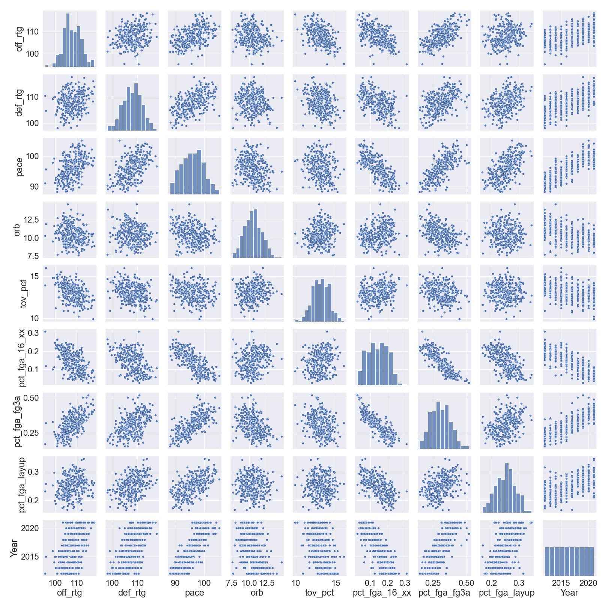

# Linear Regression MVP
## Is "MoreyBall" "moneyball"?
##### Josh Wang
##### Feb 13 2022

---
### MVP Overview
**Goal**:
The Metropolitan Transportation Authority (MTA) has asked us to investigate when and where they can reduce the number of trains to reduce their budget. I will look at multiple potential factors that affect the MTA ridership.

**Process**:
The primary dataset has been scraped from: https://www.basketball-reference.com/

More possibly will come from: https://www.nba.com/stats/

**Preliminary visualization**:

Figure 1. Pairplot of select 9 features from the scraped NBA data.

**Preliminary conclusions**:

Looking at the "Year" variable, the basketball strategy seems to have changed over the pass decade. There also seems to be co-linearity among several variables.
